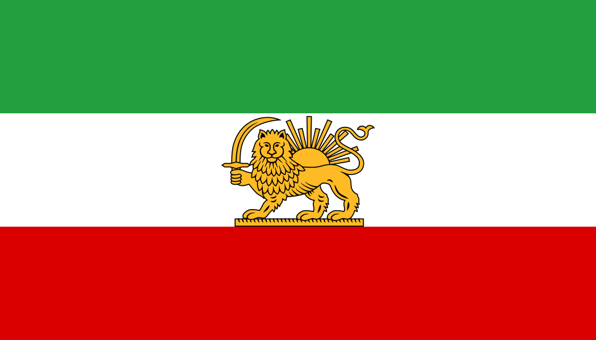

    

        
        | 
        
    

    

# Darooyar

  

  Medication management and reminder application for Android

## About

Darooyar is an Android application designed to help users manage their medications and prescriptions and stay on schedule with their medication intake.

The application focuses on simplicity, performance, and ease of use while keeping user data stored locally on the device.

## Features

* Add and manage medications
* Schedule medication intake
* Medication reminders and notifications
* Manage doctor prescriptions
* View today's medication schedule
* Manage active medications
* Add notes and images to medications
* Patient information management
* Edit and delete medications and prescriptions
* Clean and modern user interface
* Persian language and RTL support
* Local data storage

## Download

The latest version is available in the Releases section.

[Download the latest release](https://github.com/netblag/medication-reminder/releases)

## Current Version

**1.6.0**

## License

This project is released under the license specified in the repository.
